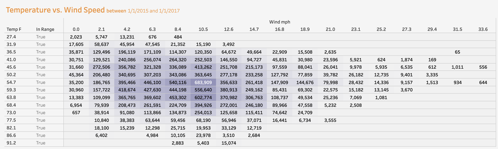
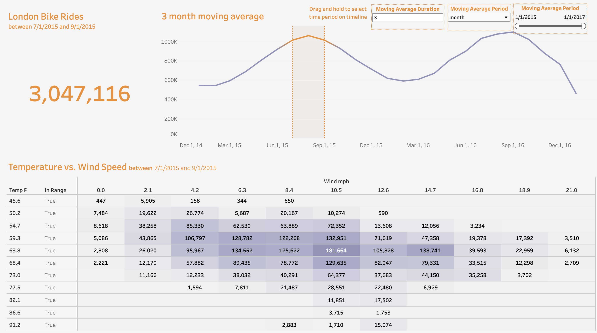
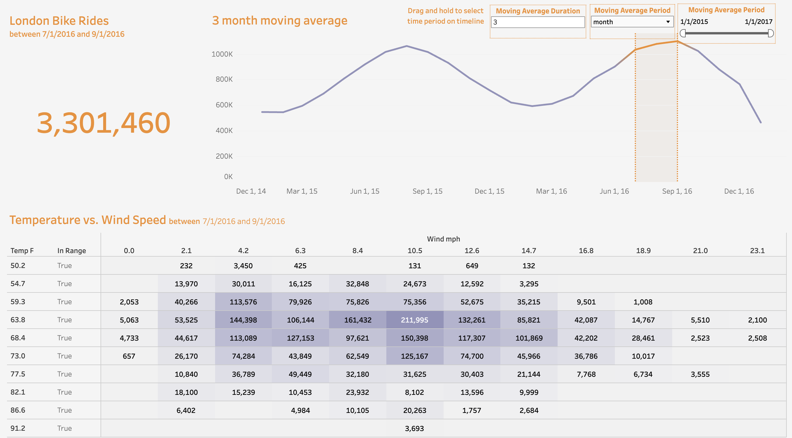
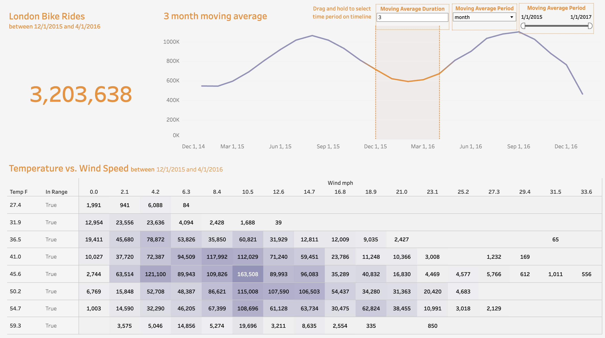

[![MIT License][license-shield]][license-url]
[![LinkedIn][linkedin-shield]][linkedin-url]

<!-- PROJECT LOGO -->
 

  

  <h3 align="center">Bike Data Analysis</h3>

  

    This project analyzes London bike-sharing data to forecast future trends. Sourced from Kaggle, the comprehensive dataset was cleaned and reformatted with Pandas for           detailed analysis. Using Tableau, the data was visualized to highlight key trends and patterns. The insights generated aim to enhance the management and allocation of         bike-sharing resources, helping predict and meet future demands efficiently.
     
     
    <a href="https://public.tableau.com/views/LondonBikeDataViz_17138947575900/Dashboard1?:language=en-US&publish=yes&:sid=2F174252498D4E6DB1D48078D4CD8D1D-0:0&:display_count=n&:origin=viz_share_link">View Demo</a>
  

<!-- TABLE OF CONTENTS -->

  
<h2 style="display: inline-block">Table of Contents</h2>

  <ol>
    <li>
      <a href="#about-the-project">About The Project</a>
      <ul>
        <li><a href="#insights">Insights</a></li>
        <li><a href="#reccomendations">Reccomendations</a></li>
        <li><a href="#built-with">Built With</a></li>
      </ul>
    </li>
    <li><a href="#license">License</a></li>
    <li><a href="#contact">Contact</a></li>
    <li><a href="#acknowledgements">Acknowledgements</a></li>
  </ol>

<!-- ABOUT THE PROJECT -->
## About The Project
This project analyzes ride-share data for rented bikes in London to predict future bike-sharing trends. The dataset, sourced from Kaggle, includes comprehensive records of bike-sharing activities. The data was cleaned and reformatted using the Python library Pandas to facilitate a more profound analysis. For visual insights, the data was further explored and visualized using Tableau, enabling clear visualization of trends and patterns. This project aims to provide actionable insights into bike-sharing usage and predict future demands, thereby assisting in better managing and allocating resources for ride-sharing services in London.

<!-- INSIGHTS -->
## Insights

### 1. Optimal Weather Conditions 
The heatmap data shows that the highest ride frequency occurs at an average temperature of 54.7°F with a wind speed of 10.5 mph. This suggests that users prefer moderately cool weather, possibly because it is comfortable for biking without excessive cold or heat.

### 2. Seasonal Peaks
The significant peaks during the summer months (July to September) in both 2015 and 2016 indicate a strong seasonal influence on bike-sharing usage. This could be due to more favorable weather, increased tourism, or leisure activities during these months.

### 3. Winter Decline
The notable decline in rides during the winter months, particularly from December 2016 to April 2016, suggests that colder, possibly harsher weather conditions deter bike use. The year-over-year decrease in winter might also indicate a lack of adequate winter biking infrastructure or incentives.

<!-- RECCOMENDATIONS -->
## Reccomendations

### 1. Marketing and Promotions
Increase marketing efforts and promotional activities during the peak months to maximize user engagement. Offering discounts, group ride options, or special event rides could further boost usage during this already popular period.

### 2. Weather-Adaptive Strategies
Considering that weather plays a significant role in ride frequency, implementing weather-adaptive strategies could help maintain or increase ridership. For instance, offering weather gear rentals or promotions on days with less-than-ideal weather conditions might encourage more consistent usage throughout the year.

### 3. Winter Program Development
Develop specific programs aimed at encouraging winter rides, such as winter biking workshops, heated bike docks, or winter ride challenges with rewards.

### 4. Infrastructure Improvements
Invest in infrastructure improvements that cater to the comfort and safety of riders, especially during less favorable weather conditions. This can include better-lit paths, maintained bike lanes free of ice and snow, and more sheltered bike stations.

### 5. Data-Driven Maintenance and Redistribution
Use data analytics to optimize bike maintenance and redistribution. Concentrate resources on high-demand areas during peak seasons and ensure that bikes are well-maintained and readily available. Consider conducting maintenance on units and swapping during slow seasons.

### 6. Long-Term Planning and Policy Making
Use the insights from data trends to guide long-term planning and policy decisions. This might involve adjusting transportation policies to better integrate bike-sharing with other public transport options, especially during high-demand periods.

## Built With

* [Python](https://www.python.org/)
* [Tableau Public](https://public.tableau.com/)
* [Kaggle](https://www.kaggle.com/)

<!-- LICENSE -->
## License

Distributed under the MIT License and Powered by TfL Open Data. Contains OS data © Crown copyright and database rights 2016' and Geomni UK Map data © and database rights (2019) See `LICENSE` for more information.

<!-- CONTACT -->
## Contact

Austin Andrade - [Connect with Me](https://www.linkedin.com/in/austinandrade/) - austinmandrade@gmail.com

Project Link: [https://github.com/austinandrade/bike_data_analysis](https://github.com/austinandrade/bike_data_analysis)

<!-- ACKNOWLEDGEMENTS -->
## Acknowledgements

* [Dataset](https://www.kaggle.com/datasets/hmavrodiev/london-bike-sharing-dataset/data)
* [pandas - Python Data Analysis Library](https://pandas.pydata.org/)
* [Zipfile36](https://pypi.org/project/zipfile36/)

<!-- MARKDOWN LINKS & IMAGES -->
<!-- https://www.markdownguide.org/basic-syntax/#reference-style-links -->
[license-shield]: https://img.shields.io/github/license/austinandrade/bike_data_analysis.svg?style=for-the-badge
[license-url]: https://github.com/austinandrade/bike_data_analysis/blob/main/LICENSE.txt
[linkedin-shield]: https://img.shields.io/badge/-LinkedIn-black.svg?style=for-the-badge&logo=linkedin&colorB=555
[linkedin-url]: https://www.linkedin.com/in/austinandrade/
